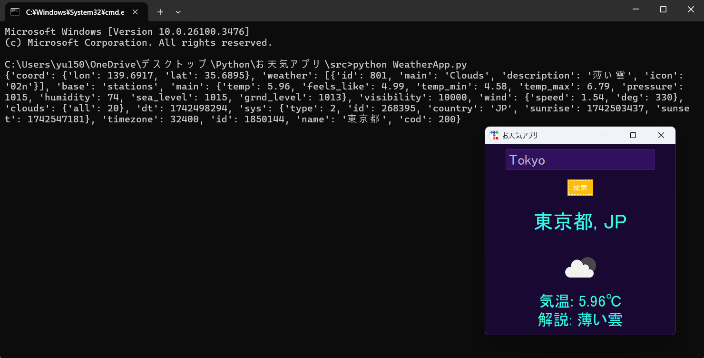

# お天気アプリ(Python ttkbootstrap版)
OpenWeatherMap API を利用してリアルタイムの天気情報を取得し、表示するお天気アプリのPython ttkbootstrap版になります。




## 実行方法
1. **必要環境**
- Python 3
- Tkinter
- ttkbootstrap

2. **リポジトリをクローン(ダウンロード)**
```sh
git clone https://github.com/motomasMINO/WeatherApp-Python.git

cd WeatherApp-Python
```
3. **アプリ起動**
```sh
python WeatherApp.py
```
## 📜 ライセンス
このプロジェクトはMIT Licenseのもとで公開されています。

## 📧 お問い合わせ
- **Github: motomasMINO**

- **Email: yu120615@gmail.com**

  バグ報告や改善点・機能追加の提案はPull RequestまたはIssueで受け付けています!